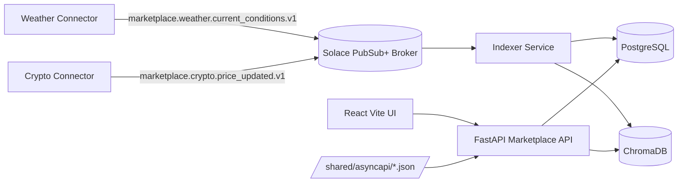

# asyncapi-marketplace

Modernized AsyncAPI Marketplace built with Solace PubSub+, FastAPI, React, Postgres, and Chroma.

## Architecture

## Services

- `infra/docker-compose.yml`
- `connectors/weather_connector.py`
- `connectors/crypto_connector.py`
- `indexer/indexer.py`
- `api/app/main.py`
- `web/` React app

## Run Locally

1. Copy env file:
   - `cp .env.example .env` (macOS/Linux)
   - `Copy-Item .env.example .env -Force` (PowerShell)
2. Start all services:
   - `docker compose up --build`
3. Open:
   - UI: `http://localhost:5173`
   - API: `http://localhost:8000`
   - Solace UI: `http://localhost:8080` (admin/admin)

### Frontend Fallback (if web container build is slow)

If `web` image build hangs during `npm install` on Windows, run frontend locally:

1. Keep backend services running via Docker (`api`, `postgres`, `chroma`, `solace`, connectors, indexer).
2. Run:
   - `cd web`
   - `npm install`
   - `npm run dev`
3. Open `http://localhost:5173`.

## Demo Steps

1. Open UI and click **Issue API Key**.
2. Browse topic catalog on `/`.
3. Open topic detail page.
4. Click **Subscribe WebSocket** to see live feed.
5. Use replay controls with ISO timestamps.
6. Use Agent Assist on home page with a goal (example: `monitor BTC movement`).

## API Highlights

- `POST /apikeys`
- `GET /topics`
- `GET /topics/{name}`
- `GET /topics/{name}/history?limit=100`
- `GET /topics/{name}/replay?since=<iso>&until=<iso>`
- `WS /ws/subscribe?topic=<name>`
- `POST /search/semantic`
- `POST /agent/recommend`
- `GET /health`
- `GET /metrics`

## Tests

- Schema validation tests: `api/tests/test_schema_validation.py`
- Health test: `api/tests/test_health.py`

Run:

- `cd api && pytest -q`

## 5-Minute Demo Script

1. Start stack: `docker compose up --build`
2. Open `http://localhost:5173`
3. Click **Issue API Key**
4. Open `marketplace.crypto.price_updated.v1`
5. Click **Subscribe WebSocket** and verify live events arrive every ~20-30 seconds.
6. Check **History** updates and run **Replay** with:
   - since: now minus 15 minutes (ISO)
   - until: now (ISO)
7. Use **Agent Assist** with: `monitor crypto market changes`
8. Verify API metrics: `http://localhost:8000/metrics` (look for `events_ingested_total > 0`)

## Known Issues / Notes

- First startup can require service warm-up (Solace and Postgres readiness).
- WebSocket disconnects on page refresh by design in v1; click subscribe again.
- Chroma telemetry warnings may appear in logs; non-blocking for local dev.

## Notes

- Topic registry is seeded from `shared/asyncapi/*.json` at API startup.
- Events are idempotent by `event_id` in indexer inserts.
- Chroma embeddings use deterministic vectors (no external LLM required for v1).
