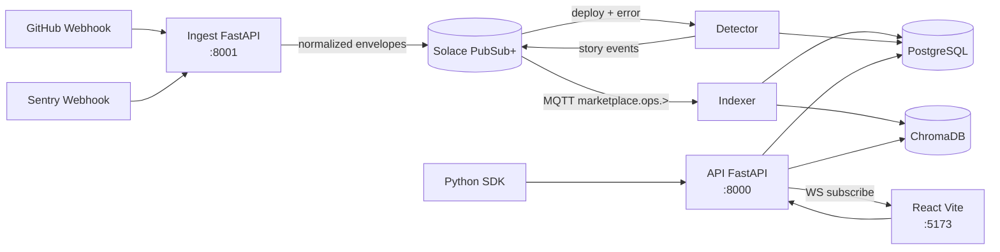

## signalhub

AI-native, replayable **operational signal layer** for SaaS teams.  
SignalHub ingests GitHub deploy and Sentry error events, normalizes them into a shared envelope, builds a unified causal timeline, and exposes an AI-friendly API and UI for discover / subscribe / replay.

---

### Problem

Modern SaaS teams drown in deploy logs, error dashboards, and ad‑hoc incident docs. Correlating “what shipped” with “what broke” still means hopping between GitHub, Sentry, dashboards, and Slack threads.

### Solution

SignalHub turns raw operational exhaust into a **single, replayable signal layer**:

- GitHub and Sentry webhooks are normalized into a common event envelope.
- Events are streamed through Solace PubSub+ and stored in Postgres + Chroma.
- A FastAPI backend powers incident detection, replay, and semantic/agent endpoints.
- A React frontend visualizes timelines, incidents, and AI recommendations.

The result is an **AI-native, incident-aware substrate** you can demo, extend, or integrate into your own ops tooling.

---

## Quick start

```bash
cp .env.example .env
docker compose up --build
```

- Web UI: `http://localhost:5173`
- API: `http://localhost:8000`
- Ingest: `http://localhost:8001`
- Chroma (debug): `http://localhost:8002`

For development, you can also run individual services with their `Dockerfile`s or `requirements.txt` as needed.

---

## Core features

- **Unified event envelope** for deploys, errors, and incident stories.
- **Topic catalog** backed by AsyncAPI definitions.
- **Operational timeline** combining deploy markers, Sentry errors, and story cards.
- **Incident detection + replay** around suspected deploys.
- **Semantic search** over operational history using Chroma.
- **Agent recommendations** that suggest topics and replay windows based on your goal.
- **Python SDK** for programmatic discover / subscribe / replay.

---

## Architecture overview



### Topics (v1)

- `marketplace.ops.github.deployment.v1`
- `marketplace.ops.sentry.error_event.v1`
- `marketplace.ops.incident.story.v1`

Envelope shape:

```json
{
  "event_id": "uuid",
  "ts": "ISO8601",
  "source": "github|sentry|detector",
  "topic": "string",
  "tags": {
    "repo": "optional",
    "env": "optional",
    "service": "optional",
    "release": "optional",
    "deploy_id": "optional",
    "commit": "optional",
    "fingerprint": "optional"
  },
  "payload": {}
}
```

---

## Primary demo flow

The main story: **GitHub deploy → Sentry errors → Incident → Replay → Agent recommendation.**

1. **Create an API key**
   ```bash
   curl -X POST http://localhost:8000/apikeys
   ```
2. **Connect GitHub + Sentry webhooks (via ngrok)**

   - Start SignalHub:
     ```bash
     cp .env.example .env
     docker compose up --build -d
     ```
   - Start ngrok for ingest:
     ```bash
     ngrok http 8001
     ```
   - Note the HTTPS URL, e.g. `https://abcd-1234.ngrok-free.app`.
   - GitHub webhook:
     - Payload URL: `https://abcd-1234.ngrok-free.app/webhooks/github`
     - Content type: `application/json`
     - Secret: `GITHUB_WEBHOOK_SECRET` from `.env`
     - Events: **Push** plus a deploy-related event (`deployment_status` or `workflow_run`).
   - Sentry webhook:
     - URL: `https://abcd-1234.ngrok-free.app/webhooks/sentry`
     - If `SENTRY_WEBHOOK_TOKEN` is set, configure Sentry to send header `X-Sentry-Token`.

3. **Trigger a scenario**

   - Push a commit and run a deploy workflow.
   - Trigger an error in Sentry in the same environment/service.

4. **Walk the UI**

   - Open `http://localhost:5173/`:
     - Issue an API key if needed and observe the **hero summary**, **active incidents**, and **topic catalog**.
   - Open `http://localhost:5173/timeline`:
     - Show the **Live operational timeline** with deploy markers, error spikes, and story cards.
     - Use env/service filters to zoom in.
   - Open an incident from the Incidents list:
     - The **Incident hero screen** shows title, severity, status, summary, replay window, and incident stories.
     - Replay section groups deploy / error / story events as a causal timeline.
     - The **AI perspective** card surfaces recommended topics with recent activity.

5. **Inspect topics directly**

   - Visit `http://localhost:5173/topics/marketplace.ops.github.deployment.v1`:
     - See the AsyncAPI schema, recent history, live WebSocket feed, and replay controls.

6. **Optional: run the SDK demo**
   ```bash
   pip install -r sdk/requirements.txt
   export SIGNALHUB_API_KEY=<your-key>
   python sdk/examples/demo_ops.py
   ```

---

## API surface (core)

- `POST /apikeys`
- `GET /topics`, `GET /topics/{name}`
- `GET /topics/{name}/history?limit=100`
- `GET /topics/{name}/replay?since=&until=`
- `GET /incidents`, `GET /incidents/{id}`
- `GET /incidents/{id}/replay?window_minutes=30`
- `POST /search/semantic`
- `POST /agent/recommend`
- `WS /ws/subscribe?topic=&api_key=`
- `GET /health`, `GET /metrics`

---

## Tech stack

- **Backend**
  - FastAPI
  - PostgreSQL (events, incidents, topics, audit logs)
  - Solace PubSub+ (MQTT)
  - ChromaDB (semantic index)
  - Sentry (optional instrumentation)
- **Frontend**
  - React + Vite
  - React Router
  - Custom dark-theme styling tailored for observability dashboards
- **SDK**
  - Python client for discover / subscribe / replay

---

## Tests

- Webhook signature verification: `pytest ingest/tests/test_signature.py`
- Schema validation: `pytest api/tests/test_schema_validation.py`
- API health integration test: `pytest api/tests/test_health_integration.py`

---

## Adding a new signal source

1. Add an AsyncAPI JSON under `shared/asyncapi/` with an `EventEnvelope`-style schema and channel topic.
2. Update ingest mappings to normalize the source payload into envelope `tags` + `payload`.
3. Validate against the topic schema and publish to Solace.
4. Extend indexer rules so useful fields are embedded into Chroma.
5. Add detector correlation logic if the source should influence incident/story creation.
6. (Optional) Update web UI labels / filters if the new topic should be first-class in the catalog/timeline.

---

## Roadmap (short)

- Refine incident detection heuristics and story text.
- Add lightweight multi-tenant / project scoping.
- Enrich the AI assistant with more domain-specific prompt templates.
- Ship additional reference connectors (e.g. status page, CI, feature flag changes).
